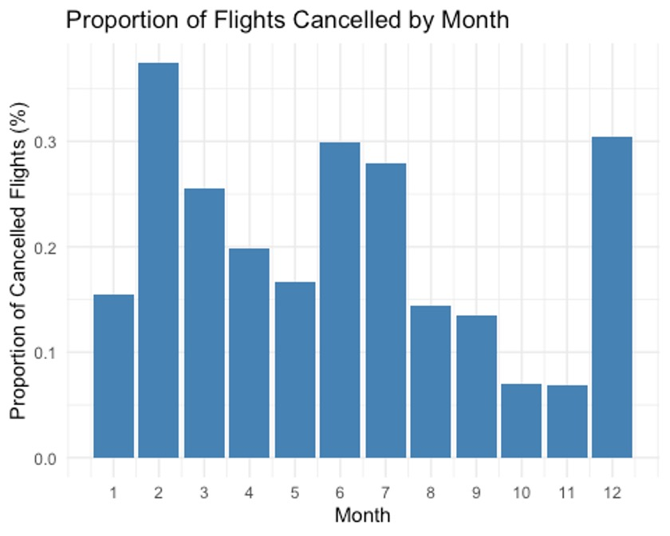

---
categories:
- ""
- ""
date: "2017-10-31T22:42:51-05:00"
description: Analyzing flight details using Data Analysis and Manipulation
draft: false
image: pic11.jpg
keywords: ""
slug: flights
title: Various Flight Analysis
---

Problem 1: What months had the highest and lowest proportion of cancelled flights? Interpret any seasonal patterns.

``` r
cancelled_flights <- flights %>%
  filter(is.na(dep_time))

#Calculate proportion of flights cancelled by month:
cancelled_flights_month <- cancelled_flights %>%
  group_by(month) %>%
  summarise(cancelled_prop = n() / nrow(flights) * 100) # Calculate the ratio of cancelled flights to the total number of flights and multiply by 100 to get percentages


ggplot(cancelled_flights_month, aes(x = month, y = cancelled_prop)) +
  geom_bar(stat = "identity", fill = "steelblue") +
  labs(x = "Month", y = "Proportion of Cancelled Flights (%)", title = "Proportion of Flights Cancelled by Month") +
  scale_x_continuous(breaks = 1:12)+
  theme_minimal()
```

Problem 2: What months had the highest and lowest proportion of cancelled flights? Interpret any seasonal patterns.

``` r
cancelled_flights <- flights %>%
  filter(is.na(dep_time))

# Calculate proportion of flights cancelled by month
cancelled_flights_month <- cancelled_flights %>%
  group_by(month) %>%
  summarise(cancelled_prop = n() / nrow(flights) * 100) # Calculate the ratio of cancelled flights to the total number of flights and multiply by 100 to get percentages


ggplot(cancelled_flights_month, aes(x = month, y = cancelled_prop)) +
  geom_bar(stat = "identity", fill = "steelblue") +
  labs(x = "Month", y = "Proportion of Cancelled Flights (%)", title = "Proportion of Flights Cancelled by Month") +
  scale_x_continuous(breaks = 1:12)+
  theme_minimal()
  
# Month with highest proportion of cancelled flights
highest_cancelled_month <- cancelled_flights_month %>%
  filter(cancelled_prop == max(cancelled_prop))

highest_cancelled_month

# Month with lowest proportion of cancelled flights
lowest_cancelled_month <- cancelled_flights_month %>%
  filter(cancelled_prop == min(cancelled_prop))

lowest_cancelled_month
```

With regards to seasonal patters, it appears there is a spike in cancellations during the start of summer time (June and July) and during peak winter periods (December and February).

Problem 3:What plane (specified by the tailnum variable) traveled the most times from New York City airports in 2013? Please left_join() the resulting table with the table planes (also included in the nycflights13 package).

``` r
#Flights from New York City airports in 2013
nyc_flights <- flights %>%
  filter(year == 2013, origin %in% c("JFK", "LGA", "EWR"))

nyc_flights <- nyc_flights %>%
  filter(!is.na(tailnum))

# Number of flights for each plane
plane_count <- nyc_flights %>%
  group_by(tailnum) %>%
  summarise(flight_count = n()) %>%
  arrange(desc(flight_count))

# Planes with more than 50 seats
planes_with_50_seats <- planes %>%
  filter(seats > 50, !is.na(seats))

#Combine the number of planes with the planes table
most_frequent_plane <- left_join(plane_count, planes_with_50_seats, by = "tailnum")

#Plane with the greatest number of flights
most_frequent_plane <- most_frequent_plane %>%
 filter(flight_count == max(flight_count))

most_frequent_plane
```


